# Global Pose Estimation for Optimal Target Shapes

## Overview
This is a package for the generation of the optimal shape, described in paper: **Optimal Target Shape for LiDAR Pose Estimation** ([PDF](./OptimalShape_WOSolver_RAL_Longer.pdf))([arXiv](https://arxiv.org/abs/2109.01181)). This work is submitted to IEEE Robotics and Automation Letters.

Both the simulation and the experimental results (verified by a motion capture system) confirm that by using the optimal shape and the global solver, we achieve **centimeter error in translation and a few degrees in rotation even when a partially illuminated target is placed 30 meters away.**


* Author: Jiunn-Kai (Bruce) Huang, William Clark, and Jessy W. Grizzle 
* Maintainer: [Bruce JK Huang](https://www.BrucebotStudio.com/), brucejkh[at]gmail.com
* Affiliation: [The Biped Lab](https://www.biped.solutions/), the University of Michigan

This package has been tested under MATLAB2020a and Ubuntu 18.04.\
**[Note]** More detailed introduction will be updated shortly. Sorry for the inconvenient!\
**[Issues]** If you encounter _any_ issues, I would be happy to help. If you cannot find a related one in the existing issues, please open a new one. I will try my best to help!

Table of Contents
=================

* [Global Pose Estimation for Optimal Target Shapes](#global-pose-estimation-for-optimal-target-shapes)
* [Overview](#overview)
* [Table of Contents](#table-of-contents)
* [Abstract](#abstract)
* [Video](#video)
* [Quick View](#quick-view)
* [Why Optimal Shape?](#why-optimal-shape)
* [How is the Optimal Generated?](#how-is-the-optimal-generated)
* [Pose Definition and Estimation](#pose-definition-and-estimation)
* [Algorithm Evaluations](#algorithm-evaluations)
  * [Simulation Results](#simulation-results)
     * [Qualitative Evaluations](#qualitative-evaluations)
     * [Quantitative Evaluations](#quantitative-evaluations)
  * [Experimental Results](#experimental-results)
     * [Qualitative Evaluations](#qualitative-evaluations-1)
     * [Quantitative Evaluations](#quantitative-evaluations-1)
* [Required Toolboxes / Library / Packages](#required-toolboxes--library--packages)
* [Paper Results for the Target's Pose](#paper-results-for-the-targets-pose)
* [Paper Results for Target Shape Generation and Make your Own Optimal Target Shape](#paper-results-for-target-shape-generation-and-make-your-own-optimal-target-shape)
* [Citations](#citations)


## Abstract
Targets are essential in problems such as object tracking in cluttered or textureless environments, camera (and multi-sensor) calibration tasks, and simultaneous localization and mapping (SLAM). Target shapes for these tasks typically are symmetric (square, rectangular, or circular) and work well for structured, dense sensor data such as pixel arrays (i.e., image). However, symmetric shapes lead to pose ambiguity when using sparse sensor data such as LiDAR point clouds and suffer from the quantization uncertainty of the LiDAR. This paper introduces the concept of optimizing target shape to remove pose ambiguity for LiDAR point clouds. A target is designed to induce large gradients at edge points under rotation and translation relative to the LiDAR to ameliorate the quantization uncertainty associated with point cloud sparseness. Moreover, given a target shape, we present a means that leverages the target’s geometry to estimate the target’s vertices while globally estimating the pose. Both the simulation and the experimental results (verified by a motion capture system) confirm that by using the optimal shape and the global solver, we achieve centimeter error in translation and a few degrees in rotation even when a partially illuminated target is placed 30 meters away. 


## Video
Please checkout the introduction [video](https://www.brucebotstudio.com/optimal-shape). It highlights some important keypoints in the paper!
[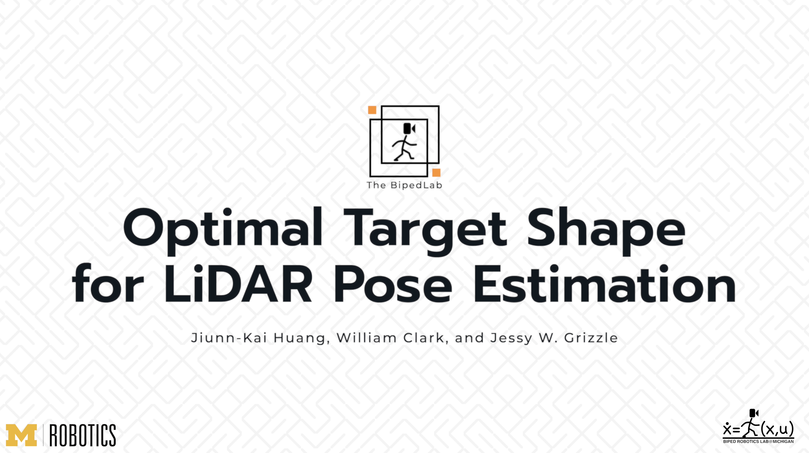](https://www.brucebotstudio.com/optimal-shape)


## Quick View
Both the simulation and the experimental results (verified by a motion capture system) confirm that by using the optimal shape and the global solver, we achieve centimeter error in translation and a few degrees in rotation even when a partially illuminated target is placed 30 meters away.
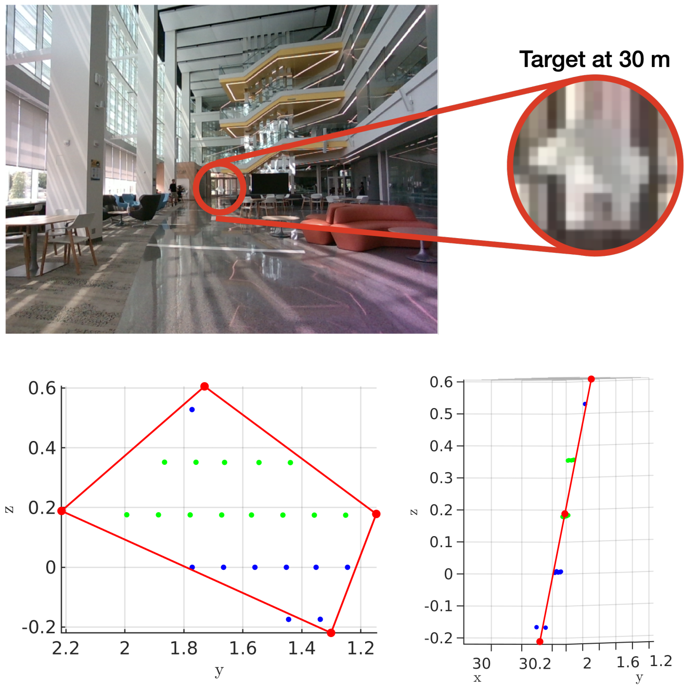


## Why Optimal Shape?
Symmetric shapes lead to pose ambiguity when using sparse sensor data such as LiDAR point clouds and suffer from the quantization uncertainty of the LiDAR. This paper introduces the concept of optimizing target shape to remove pose ambiguity for LiDAR point clouds. A target is designed to induce large gradients at edge points under rotation and translation relative to the LiDAR to ameliorate the quantization uncertainty associated with point cloud sparseness.

This target can be used in tandem with fiducial markers such as LiDARTag ([paper](https://ieeexplore.ieee.org/abstract/document/9392337), [GitHub](https://github.com/UMich-BipedLab/LiDARTag)) and LiDAR-camera extrinsic calibration ([paper](https://ieeexplore.ieee.org/document/9145571), [GitHub](https://github.com/UMich-BipedLab/extrinsic_lidar_camera_calibration)).

The following shows the resulting optimal shape in arbitrary units.
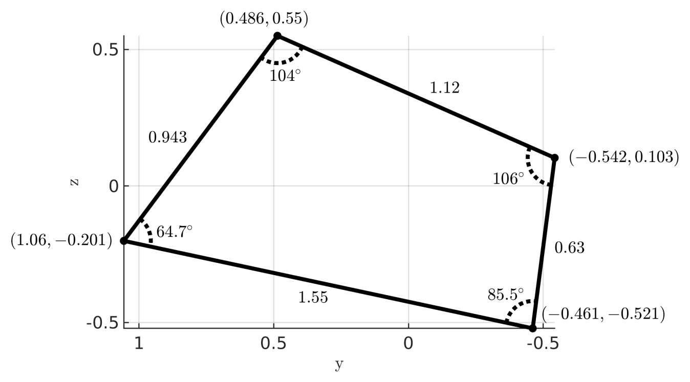

## How is the Optimal Generated?
Projective transformations applied to a nominal quadrilateral generate candidate convex quadrilaterals (targets). Edge points are intersections of LiDAR rings with the target boundaries. The objective is to maximize the gradient of edge points under actions of SE(2) applied to the target. To enhance robustness, the gradients are computed for n-discrete rotations of the quadrilateral under partial illumination, and the score is the worst case.

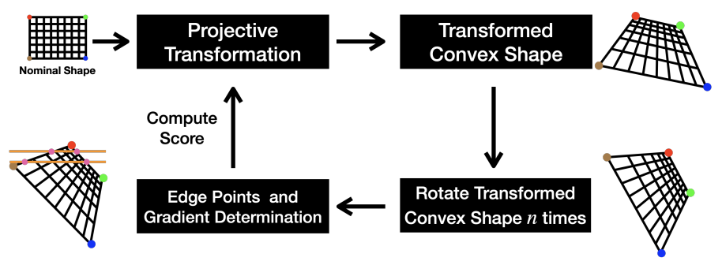


## Pose Definition and Estimation 
A coordinate frame for the template (target shown in black) is defined by aligning the plane of the template with the y-z plane of the LiDAR frame and also aligning the mean of its vertices with the origin of the LiDAR.

Let  (blue arrow) be an estimate of the rigid-body transformation from target to LiDAR, projecting the edge points of the target back to the template. The estimated pose of the target is then given by the inverse transformation,  (green arrow). The optimal  is obtained by minimizing (18) (based on point-to-line distance). This figure also shows a fitting result of a target at 2 meters in the Ford Robotics Building. The red frame is the template re-projected onto the LiDAR point cloud by .

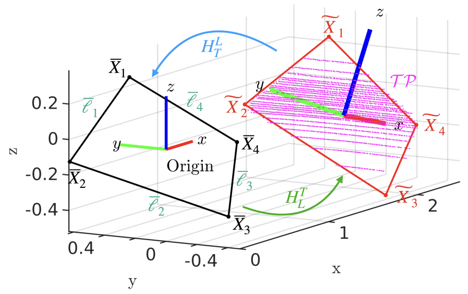


## Algorithm Evaluations
We evaluate the proposed algorithm in both simulation and experiments. Both quantitative and qualitative results are provided. We do not compare against standard targets, such as unpatterned rectangles, diamonds, or circles, because their symmetry properties result in pose ambiguity. At large distances, a pattern would not be discernible.


### Simulation Results 
Before carrying out experiments with the new target shape, we used a MATLAB-based LiDAR simulator introduced in [GitHub](https://github.com/UMich-BipedLab/lidar_simulator) to extensively evaluate the pose and vertex estimation of the optimal shape.


#### Qualitative Evaluations
Simulation results of the noise-free dataset of the pose estimation at various distances (10, 20, 30, 40 m). LiDAR returns (blue dots) on the target are provided by the LiDAR simulator[GitHub](https://github.com/UMich-BipedLab/lidar_simulator). Black indicates the ground truth pose from the simulator, and red is the estimated pose and vertices. The top and bottom show the front view and a side view of the fitting results, respectively.
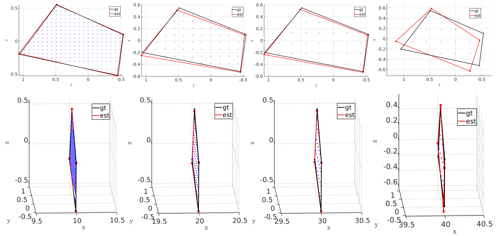


#### Quantitative Evaluations
* **Subset of Quantitative Results of the Pose and Vertex Estimation Using the Noise-free Dataset:** Pose and vertex accuracy of the simulation results at various distances.
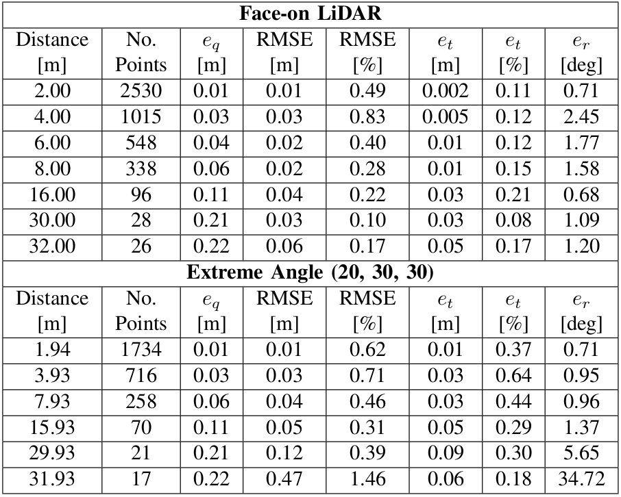

* **Complete Quantitative Results of Distances and Noise Levels:** Simulation results with a target placed at distances from 2 to 40 meters in 2 m increments in the LiDAR simulator[GitHub](https://github.com/UMich-BipedLab/lidar_simulator). At each distance, the simulation data are collected with the target face-on to the LiDAR as an easy case (solid line), and for the other, the target is rotated by the Euler angle (roll = 20 deg , pitch = 30 deg, yaw = 30 deg) as a challenging case (dashed line). In addition, we induce two different levels of noises to each dataset, as indicated by the different colors.
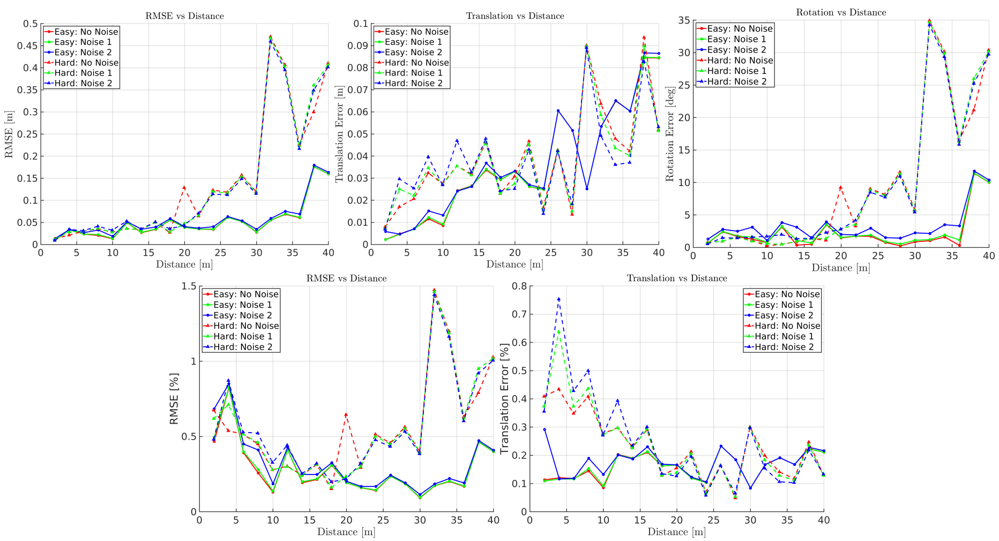


### Experimental Results 
We now present experimental evaluations of the pose and vertex estimation of the optimal shape. All the experiments are conducted with a 32-Beam Velodyne ULTRA Puck LiDAR and an Intel RealSense camera rigidly attached to the torso of a Cassie-series bipedal robot. The Qualisys motion capture system in M-Air [Website](https://robotics.umich.edu/about/mair/) is used as a proxy for ground truth poses and vertices. The setup consists of 33 motion capture cameras with passive markers attached to the target, the LiDAR and the camera.
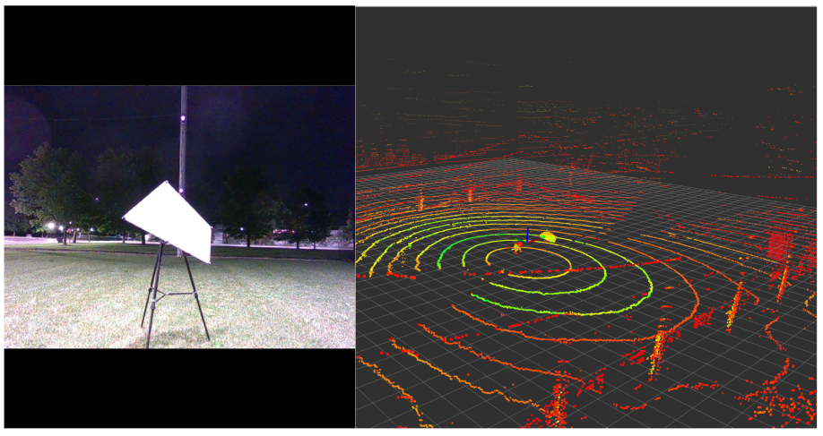


#### Qualitative Evaluations
For distances beyond 16 meters (the distance limit in M-Air), we present qualitative results from the atrium to support the simulation-based analysis.

* **No Missing Points:** Fitting results of the optimal shape at various distances (20, 24, 28, 32 meters) in the atrium of the Ford Robotics Building at the University of Michigan. The blue dots are the LiDAR returns on the target and the red frame are the fitting results. The top and bottom show the front view and a side view of the results, respectively.
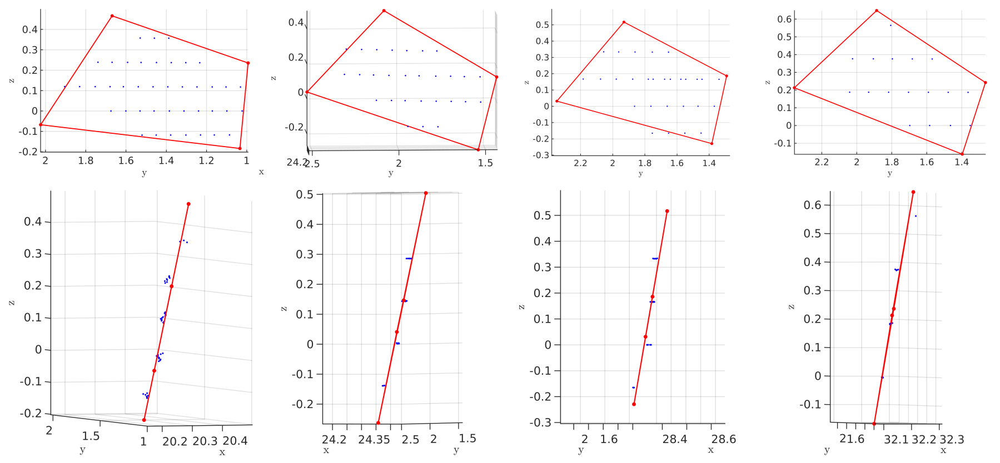


* **Green Points are Considered Missing:**
Fitting results of the partially illuminated target at various distances (4, 10, 22, 30 meters) in the atrium of the Ford Robotics Building at the University of Michigan. The selected distances are different from [No Missing Pionts](#no-missing-points) to show more results. The red frames are the fitting results. The blue dots are the LiDAR returns on the targets while the green dots are considered missing. The top and bottom show the front view and a side view of the fitting results, respectively.
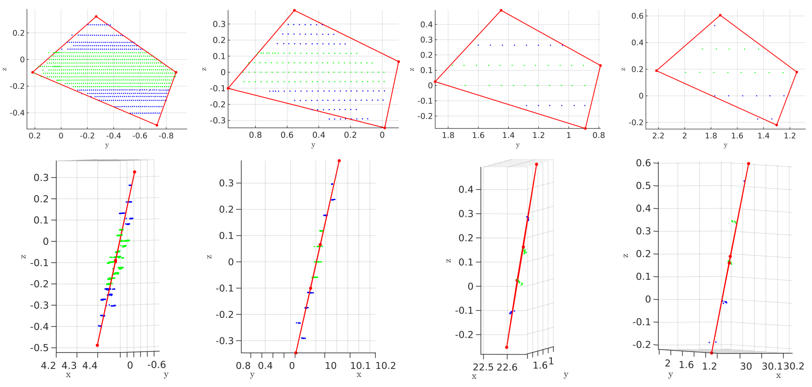

#### Quantitative Evaluations
Pose and vertex accuracy of the experimental results. The ground truth is provided by a motion capture system with 33 cameras. Similar to the simulation environment, the optimal-shape target is placed at distances from 2 to 16 meters (maximum possible in M-Air) in 2 meter increments. At each distance, data is collected with a target face-on to the LiDAR and another dataset with the target roughly rotated by the Euler angles (roll = 20 deg, pitch = 30 deg, yaw = 30 deg) as a challenging case.
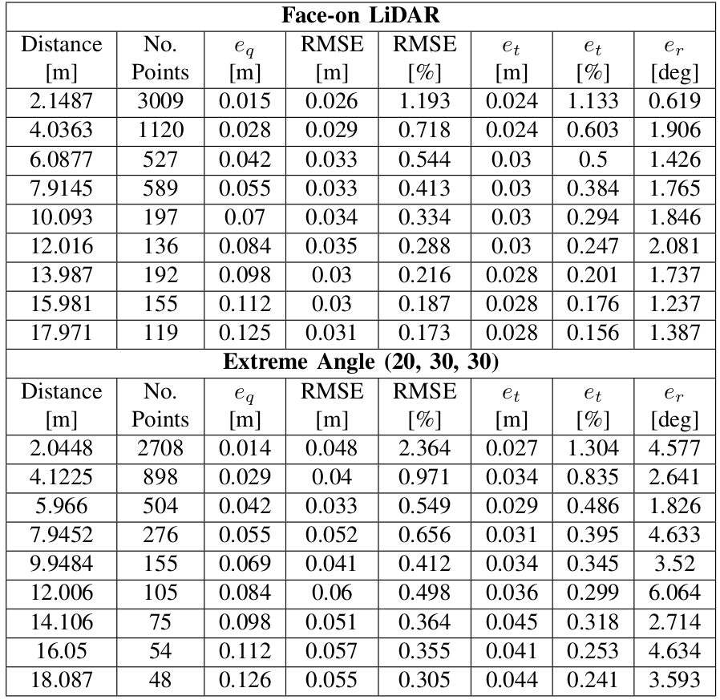


## Required Toolboxes / Library / Packages
* Required MATLAB Toolboxes
    * Optimization Toolbox
    * Phased Array System Toolbox
    * Statistics and Machine Learning Toolbox'
    * Parallel Computing Toolbox
    * Polyspace Bug Finder
* Required Library
    * [CVX](http://cvxr.com/cvx/): 
        - [Download CVX](http://cvxr.com/cvx/download/) for your platform
        - Install CVX: Run `cvx_setup.m` from Matlab
        * Please also make sure that you have it installed on your path
* Required Packages 
    * [matlab_utils](https://github.com/UMich-BipedLab/matlab_utils)
    * [global_sim3_solver](https://github.com/UMich-BipedLab/global_sim3_solver)
    * [lidar_simulator](https://github.com/UMich-BipedLab/lidar_simulator)


## Paper Results for the Target's Pose 
* To generate Fig. 8: double-click ``draw_pose_illustration.m`` and run!
* To generate Table 1 and Fig. 10: double-click ``gen_sim_table.m`` and run!
* To generate Table 2: double-click ``gen_exp_table.m`` and run!
* To generate Fig. 9, 13, and 14: 
    * double-click ``estimate_pose_of_optimal_target.m``
    * `opts.dataset`: 0 for simulation; 6 for experiments
    * `target_num_list`: 
        * Simulation: which list of angle and translation to use
            * NOTE: Given the angle and translatoin, we first transform the optimal shape and the use the [lidar_simulator](https://github.com/UMich-BipedLab/lidar_simulator) to generate the points on the target
        * Experiments: which datasets/targets to use
    * `opts.target_occlusion`: to remove points on rings or not (ONLY SUPPORT FOR EXPERIMENTAL DATA FOR NOW)
    * `opts.remove_rings`: this will remove the points on rings (ONLY SUPPORT FOR EXPERIMENTAL DATA FOR NOW)
        * For example: opts.remove_rings = 21:22 will remove all the points on ring 21 and ring 22.


## Paper Results for Target Shape Generation and Make your Own Optimal Target Shape
To generate Fig. 3, 4, and 7: Please go to another [GitHub](https://github.com/UMich-BipedLab/optimal_shape_generation) and follow the introduction there.


## Citations
The detail is described in: **Optimal Target Shape for LiDAR Pose Estimation,** Jiunn-Kai Huang, William Clark, and Jessy W. Grizzle. ([PDF](./OptimalShape_WOSolver_RAL_Longer.pdf)) ([arXiv](https://arxiv.org/abs/2109.01181))

```
@article{huang2021optimal,
      title={Optimal Target Shape for LiDAR Pose Estimation},
      author={Jiunn-Kai Huang and William Clark and Jessy W. Grizzle},
      year={2021},
      journal={arXiv preprint arXiv:2109.01181}
}
```


